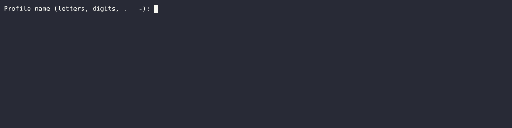
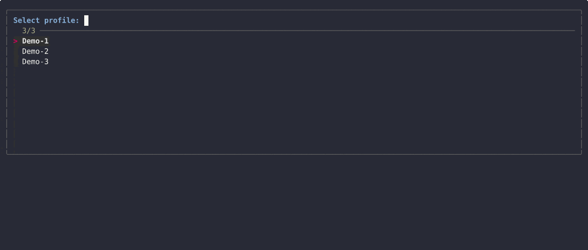

## SSH-profile-manager

[](LICENSE) [](README.md)

<p>
  <a href="https://buymeacoffee.com/bpidperygoa" target="_blank">
    
  </a>
</p>

### Demo: Creating a Profile



#### Demo: Connecting with a Profile



Simple CLI to manage and connect to SSH profiles.

### Supported platforms

- macOS (Homebrew)
- Debian/Ubuntu (apt)
- RHEL/CentOS/Fedora (yum/dnf)
- Arch (pacman)
- Alpine (apk)
- openSUSE (zypper)
- FreeBSD / Termux (pkg)

Installer auto-detects the package manager and attempts to install dependencies.

### Quick install (curl | bash)

```bash
curl -fsSL https://raw.githubusercontent.com/bpidperygora/SSH-profile-manager/main/install.sh \
  | GITHUB_REPO=bpidperygora/SSH-profile-manager bash -s -- --bin-dir=/usr/local/bin --name=ssh-connect
```

Alternative (explicit script URL):

```bash
curl -fsSL https://raw.githubusercontent.com/bpidperygora/SSH-profile-manager/main/install.sh \
  | SOURCE_URL=https://raw.githubusercontent.com/bpidperygora/SSH-profile-manager/main/ssh-connect bash -s -- --bin-dir=/usr/local/bin --name=ssh-connect
```

macOS Apple Silicon (default bin dir is `/opt/homebrew/bin`):

```bash
curl -fsSL https://raw.githubusercontent.com/bpidperygora/SSH-profile-manager/main/install.sh \
  | GITHUB_REPO=bpidperygora/SSH-profile-manager bash -s -- --bin-dir=/opt/homebrew/bin --name=ssh-connect
```

### Uninstall

```bash
curl -fsSL https://raw.githubusercontent.com/bpidperygora/SSH-profile-manager/main/uninstall.sh \
  | bash -s -- --bin-dir=/usr/local/bin --name=ssh-connect
```

### Install via Git + Make

```bash
git clone https://github.com/bpidperygora/SSH-profile-manager.git
cd SSH-profile-manager
make install
```

### Usage

```bash
ssh-connect                   # interactive selector and connect
ssh-connect <name>            # connect to profile by name
ssh-connect create            # create a new profile
ssh-connect update [<name>]   # update existing profile
ssh-connect delete [<name>]   # delete profile
ssh-connect export            # export profiles to tar.gz
ssh-connect list              # list profile names
ssh-connect help [command]    # show help
```

### Dependencies

- Required: openssl
- Optional: sshpass (password auth auto-login), fzf (nicer selector)
- On macOS, `sshpass` може вимагати сторонні taps; інсталер спробує і пропустить, якщо недоступний.
- Вимкнути авто-встановлення залежностей: `NO_DEPS=1`.

```bash
NO_DEPS=1 ./install.sh --bin-dir=/usr/local/bin --name=ssh-connect
```

### Privacy / .gitignore

- Папки `profiles/`, `exports/`, файли `*.profile`, архіви `*.tar.gz` ігноруються та не потрапляють у git.

### Troubleshooting

If you see "Too many levels of symbolic links" for `/usr/local/bin/ssh-connect`:

```bash
sudo rm -f /usr/local/bin/ssh-connect \
  && curl -fsSL https://raw.githubusercontent.com/bpidperygora/SSH-profile-manager/main/install.sh \
  | GITHUB_REPO=bpidperygora/SSH-profile-manager bash -s -- --bin-dir=/usr/local/bin --name=ssh-connect
```

### Promo checklist

- Add GitHub topics: `ssh`, `cli`, `bash`, `devops`, `sysadmin`, `security`, `fzf`.
- Create release `v0.1.0` and tag.
- Ensure install one-liner is in README (Quick install section).
- Add demo assets to `docs/` and ensure embeds render at the top of README.

Example commands:

```bash
# Move assets into repo (adjust paths if needed)
mkdir -p docs
mv ~/create.gif docs/create.gif
mv ~/use.gif docs/use.gif

git add docs/create.gif docs/use.gif README.md
git commit -m "ADDED: demo GIFs. UPDATED: README with badges and demos."

git push origin HEAD

git tag v0.1.0
git push origin v0.1.0
```

Using GitHub CLI for topics and release:

```bash
# Set topics (requires: gh auth login)
gh repo edit --add-topic ssh --add-topic cli --add-topic bash --add-topic devops --add-topic sysadmin --add-topic security --add-topic fzf

# Create GitHub release with the main script attached
gh release create v0.1.0 ssh-connect --title "v0.1.0" --notes "ADDED: initial release."
```


